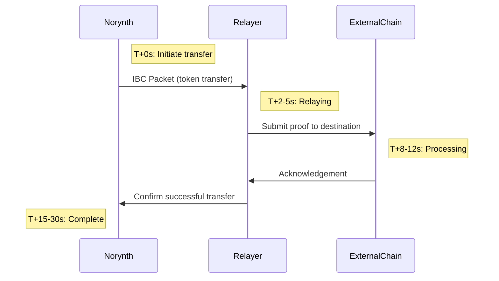

# Inter-Blockchain Communication (IBC)

Norynth Chain enables cross-chain operations via IBC. This guide covers:

## IBC Packet Flow



### ASCII Art Alternative (if Mermaid isn't supported)

```
[ Norynth ] -- IBC Packet --> [ Relayer ]
                |
                v
[ External Chain ] -- Ack --> [ Relayer ] --> [ Norynth ]
```

---

## 1. Relayer Setup Guide

```bash
# Install Hermes relayer (recommended)
curl -sSL https://get.helm.sh/relayer-v1.5.0-linux-amd64 | sudo tar -xz -C /usr/local/bin

# Configure chains
hermes config add-chain --chain-id noyn-testnet-1 --rpc-addr http://localhost:26657

# Create keys
hermes keys add --chain noyn-testnet-1 --key-file wallet.json

# Establish connection (typically 3–5 minutes)
hermes create connection --a-chain noyn-testnet-1 --b-chain osmosis-1

# Start relayer (persistent process)
hermes start
```

---

## 2. IBC Operations

### 2.1 Enable IBC (1–2 minutes)

```bash
# Install IBC module
ignite chain install ibc

# Verify IBC status
noynd query ibc client states
```

### 2.2 Establish Connection (3–7 minutes)

```bash
# Open channel to another chain (Osmosis example)
noynd tx ibc channel open transfer ics20-1 \
  --connection-id connection-0 \
  --from validator \
  --chain-id noyn-testnet-1 \
  --gas auto
```

### 2.3 Transfer Tokens (15–30 seconds)

```bash
# Real testnet example (sent to Osmosis)
noynd tx ibc-transfer transfer transfer channel-42 osmo1q8tq5qhrhw6s7xnza7j4atq4x0x7w5q9j0z2z3 100000000unoyn \
  --from validator \
  --chain-id noyn-testnet-1 \
  --memo "Test transfer 2024-05-20" \
  --gas-adjustment 1.5 \
  --packet-timeout-height 0-100000
```

### 2.4 Verify Transactions

```bash
# Real packet example from testnet
noynd query ibc channel packet-commitments transfer channel-42 \
  --node https://rpc.testnet.norynth.com:443

# Example output:
# commitments:
# - sequence: "420"
#   commitment: A3F5B2...
```

---

## Testnet Reference

```toml
# config.toml
[ibc]
testnet_peers = [
  "peer1.testnet.norynth.com:26656",
  "peer2.testnet.norynth.com:26656"
]
rpc_timeout = "10s"
packet_timeout = "30s"  # Added timeout parameter
```

---

## Troubleshooting

### Common Issues

**Timeout Errors (extend timeout):**

```bash
--packet-timeout-timestamp $(($(date +%s) + 600))  # 10 minute timeout
```

**Relayer Not Forwarding:**

```bash
hermes clear packets --chain noyn-testnet-1 --port transfer --channel channel-42
```

**Balance Not Updating:**

```bash
# Check pending packets
noynd query ibc channel unreceived-packets transfer channel-42
```

---

## Key Placeholders

| Parameter            | Example Value                         | Description                    |
|----------------------|----------------------------------------|--------------------------------|
| `[YOUR_KEY]`         | `validator`                           | Your local wallet name         |
| `[RECIPIENT_ADDRESS]`| `osmo1q8tq...`                        | Destination chain address      |
| `[EXTERNAL_CHAIN_CLI]`| `osmod`                              | External chain’s CLI binary    |
